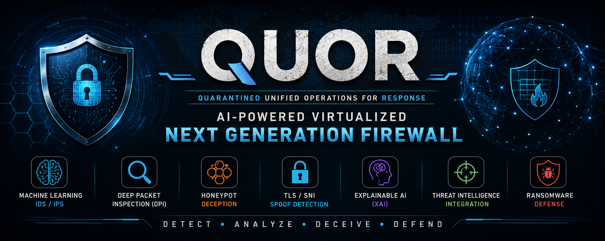
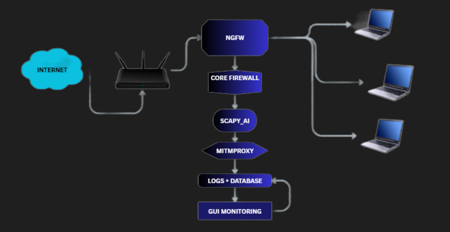
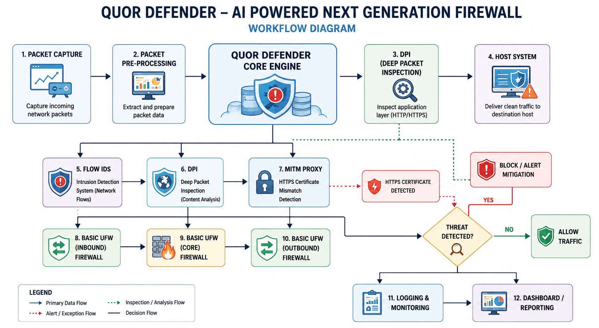

<p align="center">
  
</p>

<h1 align="center">🛡️ QUOR</h1>

<h3 align="center">
Quarantined Unified Operations for Response
</h3>

<p align="center">
<b>AI-Powered Virtualized Next Generation Firewall</b>
</p>

<p align="center">
Machine Learning • Deep Packet Inspection • Honeypot • Explainable AI
</p>

<p align="center">


</p>

---

# 📑 Table of Contents

- [Overview](#-overview)
- [Key Features](#-key-features)
- [System Architecture](#-system-architecture)
- [Workflow Diagram](#-workflow-diagram)
- [Dashboard](#-dashboard)
- [Installation](#-installation)
- [Project Structure](#-project-structure)
- [Technologies Used](#-technologies-used)
- [Documentation](#-documentation)
- [Project Workflow](#-project-workflow)
- [Team](#-team)
- [Future Improvements](#-future-improvements)
- [License](#-license)

---

# 📖 Overview

**QUOR (Quarantined Unified Operations for Response)** is an AI-powered, virtualized **Next Generation Firewall (NGFW)** developed as a Final Year Cyber Security project.

Unlike traditional firewalls that primarily rely on static rules and signature-based detection, QUOR combines **Machine Learning**, **Deep Packet Inspection (DPI)**, **Explainable AI (XAI)**, **Threat Intelligence**, **TLS/SNI Spoof Detection**, **Honeypot-based Deception**, and **Behavior-based Ransomware Detection** into a unified and modular security platform.

The system is designed to detect both known and previously unseen attacks while providing transparent explanations for AI-based decisions.

---

# 🚀 Key Features

| Feature | Description |
|----------|-------------|
| 🧠 AI-powered IDS/IPS | Detects malicious traffic using Machine Learning |
| 🔍 Deep Packet Inspection | Analyses packet payloads beyond traditional headers |
| 🔐 TLS/SNI Spoof Detection | Detects spoofed certificates and MITM attacks |
| 🍯 Integrated Honeypot | Captures attacker behaviour safely |
| 🦠 Ransomware Detection | Detects suspicious file encryption behaviour |
| 💡 Explainable AI | Explains why the AI classified traffic as malicious |
| 🌍 Threat Intelligence | Integrates VirusTotal, AbuseIPDB and AlienVault OTX |
| 📊 Flask Dashboard | Live monitoring and event visualization |

---

# 🏗 System Architecture

<p align="center">

</p>

---

# 🔄 Workflow Diagram

<p align="center">

</p>

---

# 📸 Dashboard

<p align="center">

</p>

---

# ⚙️ Installation

## Clone Repository

```bash
git clone https://github.com/QUORDEFENDER/QUOR-AI-NGFW.git

cd QUOR-AI-NGFW
```

## Install Dependencies

```bash
pip install -r requirements.txt
```

## Run the Application

```bash
python gui.py
```

---

# 📂 Project Structure

```text
QUOR-AI-NGFW
│
├── capture/          # Packet Capture Module
├── dpi/              # Deep Packet Inspection Engine
├── firewall/         # Firewall Decision Engine
├── honeypot/         # Honeypot Controller
├── ids/              # AI Intrusion Detection System
├── logs/             # Security Logs
├── models/           # Trained Machine Learning Models
├── ransomware/       # Ransomware Detection
├── xai/              # Explainable AI Module
│
├── Screenshots/
├── DOCUMENTS/
│
├── gui.py
├── requirements.txt
├── Project_Workflow.md
├── README.md
└── LICENSE
```

---

# 💻 Technologies Used

| Technology | Purpose |
|------------|---------|
| Python | Core Application |
| Flask | Web Dashboard |
| Scapy | Packet Capture |
| mitmproxy | TLS/SNI Inspection |
| Scikit-learn | Machine Learning Models |
| Pandas | Feature Processing |
| NumPy | Data Processing |
| Docker | Container Support |
| Linux | Deployment Platform |

---

# 📚 Documentation

| Document | Link |
|----------|------|
| 📄 Final Presentation | [Open](DOCUMENTS/QUOR_Projectppt_12_05_26.pptx) |
| 🏗 System Architecture | [Open](DOCUMENTS/Architecture.png) |
| 🔄 Workflow Diagram | [Open](DOCUMENTS/workflow.png) |
| 👤 Use Case Diagram | [Open](DOCUMENTS/UseCaseDiagram.png) |

---

# 🔄 Project Workflow

The complete implementation workflow, including module interactions and source files, is documented separately.

➡️ **[View Detailed Project Workflow](Project_Workflow.md)**

---

# 📊 Current Project Status

| Module | Status |
|----------|---------|
| Packet Capture | ✅ Completed |
| Deep Packet Inspection | ✅ Completed |
| AI IDS/IPS | ✅ Completed |
| Explainable AI | ✅ Completed |
| TLS/SNI Detection | ✅ Completed |
| Threat Intelligence | ✅ Completed |
| Honeypot | ✅ Completed |
| Ransomware Detection | ✅ Completed |
| Flask Dashboard | ✅ Completed |

---

# 👨‍💻 Team

| Name | Role |
|------|------|
| Aswin Manoj | Sni spoof detector,Dpi,Xai |
| Achala A S | Honeypot,Research & Documentation |
| Hisham Faizal | Packet capturing,ML.IDS |
| Sabari S | Ransomware Detector |

---

# 🚀 Future Improvements

- LLM-assisted Firewall Rule Generation
- Auto Policy Recommendation Engine
- Reinforcement Learning for Adaptive Firewalls
- Cloud-native Deployment
- Kubernetes Integration
- SIEM Integration
- REST API Support
- Real-time Threat Intelligence Updates

---

# 📜 License

This project is licensed under the **MIT License**.

See the [LICENSE](LICENSE) file for details.

---

<p align="center">
Made with ❤️ by Team QUORDEFENDER
</p>
