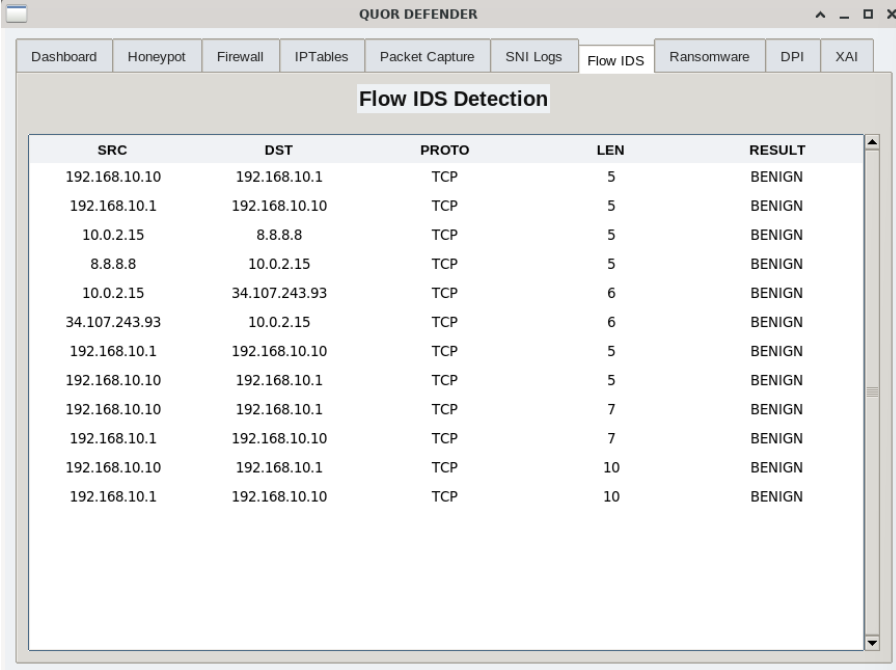

# QUOR

## Quarantined Unified Operations for Response

AI-Powered Virtualized Next Generation Firewall developed as a Final Year Cyber Security Project.

---

## Overview

QUOR is a modular Next Generation Firewall (NGFW) that combines Artificial Intelligence with traditional firewall technologies to detect both known and unknown cyber threats.

The system integrates machine learning, Deep Packet Inspection (DPI), ransomware detection, honeypot deception, TLS/SNI spoof detection, and Explainable AI into a unified security platform.

---

## Features

- AI-powered IDS/IPS
- Deep Packet Inspection (DPI)
- Explainable AI (XAI)
- TLS/SNI Spoof Detection
- Integrated Honeypot
- Ransomware Detection
- Multi-source Threat Intelligence
- Flask Web Dashboard
- Real-time Monitoring

---

## Technologies

- Python
- Flask
- Scapy
- Suricata
- Zeek
- mitmproxy
- Scikit-learn
- Docker
- Linux

---

## Project Structure

```text
capture/
dpi/
firewall/
honeypot/
ids/
models/
ransomware/
xai/
gui.py
```

---

## Project Workflow

1. Capture network packets using Scapy.
2. Perform Deep Packet Inspection (DPI).
3. Extract network flow features.
4. Analyze traffic using AI-based IDS.
5. Validate TLS certificates and SNI.
6. Check threat intelligence feeds.
7. Detect ransomware behavior.
8. Redirect suspicious traffic to the honeypot.
9. Generate Explainable AI (XAI) output.
10. Display alerts and logs on the Flask dashboard.

👉 For a detailed explanation, see [Project Workflow](Project_Workflow.md).

## Team

- Aswin Manoj
- Achala A S
- Hisham Faizal
- Sabari S

---

## Future Improvements

- LLM-assisted firewall rule generation
- Auto policy recommendation
- Reinforcement learning
- Cloud deployment
- 

## Dashboard



## Documentation

- 📄 Final Presentation: [QUOR_Final_Presentation.pdf](DOCUMENTS/QUOR_Projectppt_12_05_26.pptx)
- 🏗️ System Architecture: [Architecture.png](DOCUMENTS/Architecture.png)
- 🔄 Workflow Diagram: [Workflow.png](DOCUMENTS/workflow.png)
- 📋 Use Case Diagram: [UseCaseDiagram.png](DOCUMENTS/UseCaseDiagram.png)
